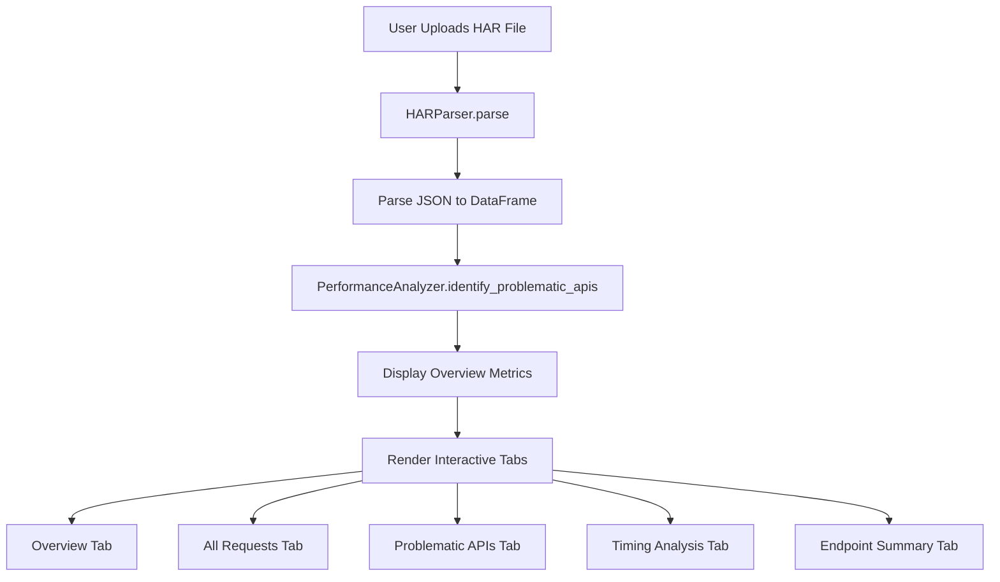

# HAR File Analyzer - Application Documentation

## Overview

[app.py](file:///media/sking/projects/1-pipelines/personal-projects/har-analyzer/app.py) is the main entry point for a **Streamlit-based web application** that analyzes HAR (HTTP Archive) files. The application provides comprehensive performance analysis and visualization of network requests captured from browser DevTools.

## Purpose

The application enables users to:
- Upload HAR files exported from browser developer tools
- Analyze API performance and network request patterns
- Identify problematic endpoints and performance bottlenecks
- Visualize timing breakdowns and request metrics

## Architecture

### Application Flow



### Module Dependencies

The application imports and orchestrates several specialized modules:

| Module | Purpose |
|--------|---------|
| `config` | Configuration constants and page settings |
| `parsers.har_parser.HARParser` | Parses HAR file content into structured data |
| `analyzers.performance_analyzer.PerformanceAnalyzer` | Identifies slow/problematic API endpoints |
| `ui.metrics.MetricsDisplay` | Renders overview metrics and KPIs |
| `ui.tabs.TabManager` | Manages different analysis view tabs |

## Code Structure

### Main Function

The `main()` function serves as the application entry point and follows this execution flow:

#### 1. **Page Configuration** (Lines 14)
```python
st.set_page_config(**PAGE_CONFIG)
```
Configures the Streamlit page with settings from `config.py`:
- Page title: "HAR File Analyzer"
- Page icon: 📊
- Layout: Wide mode
- Sidebar: Expanded by default

#### 2. **User Interface Setup** (Lines 17-30)
- Displays application title and description
- Creates sidebar with file uploader component
- Accepts `.har` file format only

#### 3. **File Processing Pipeline** (Lines 32-41)

When a file is uploaded:

**Step 1: Read & Decode**
```python
har_content = uploaded_file.read().decode('utf-8')
```
Reads the uploaded file and decodes it from bytes to UTF-8 string.

**Step 2: Parse HAR Content**
```python
df = HARParser.parse(har_content)
```
Converts HAR JSON structure into a pandas DataFrame containing request details.

**Step 3: Performance Analysis**
```python
df = PerformanceAnalyzer.identify_problematic_apis(df)
```
Analyzes the DataFrame to flag slow responses, high wait times, and connection delays based on thresholds defined in `config.py`.

#### 4. **Metrics Display** (Lines 44-45)
```python
MetricsDisplay.render_overview_metrics(df)
```
Renders high-level performance metrics such as:
- Total number of requests
- Average response time
- Number of problematic APIs
- HTTP status code distribution

#### 5. **Tabbed Interface** (Lines 50-71)

Creates five interactive tabs for different analysis views:

| Tab | Icon | Purpose | Renderer |
|-----|------|---------|----------|
| Overview | 📈 | Summary charts and visualizations | `TabManager.render_overview_tab()` |
| All Requests | 📋 | Complete table of all network requests | `TabManager.render_requests_tab()` |
| Problematic APIs | ⚠️ | Filtered view of slow/problematic endpoints | `TabManager.render_problematic_tab()` |
| Timing Analysis | ⏱️ | Detailed timing phase breakdowns | `TabManager.render_timing_tab()` |
| Endpoint Summary | 🎯 | Aggregated statistics by endpoint | `TabManager.render_endpoint_tab()` |

## Key Features

### 1. **File Upload & Validation**
- Sidebar-based file uploader
- Restricts to `.har` file extension
- Provides helpful tooltip guidance

### 2. **Loading States**
- Uses `st.spinner()` to show "Parsing HAR file..." during processing
- Improves user experience during potentially slow operations

### 3. **Data Validation**
- Checks if parsed DataFrame is not `None` and not empty
- Only proceeds with analysis if valid data exists

### 4. **Modular Design**
- Separates concerns across multiple modules
- Parser handles data extraction
- Analyzer handles performance logic
- UI components handle presentation
- Config centralizes constants

## Performance Thresholds

The application uses configurable thresholds from `config.py` to identify problematic requests:

- **Slow Response**: > 1000ms total time
- **High Wait Time**: > 500ms server processing
- **Connection Delay**: > 1000ms to establish connection
- **DNS Delay**: > 100ms for DNS resolution

## Technology Stack

- **Framework**: Streamlit (Python web framework)
- **Data Processing**: Pandas (DataFrame operations)
- **File Format**: HAR (HTTP Archive JSON format)
- **Visualization**: Streamlit charts and custom UI components

## Entry Point

```python
if __name__ == "__main__":
    main()
```

The standard Python entry point ensures `main()` is called when the script is executed directly (e.g., via `streamlit run app.py`).

## Usage

To run the application:

```bash
streamlit run app.py
```

This launches a local web server (typically at `http://localhost:8501`) where users can:
1. Upload a HAR file via the sidebar
2. View automatically generated performance metrics
3. Explore different analysis views through tabs
4. Identify and investigate problematic API endpoints

## Error Handling

The application includes basic validation:
- Checks if file is uploaded before processing
- Validates parsed DataFrame is not `None` or empty
- Only renders UI components when valid data exists

## Summary

`app.py` is a well-structured Streamlit application that serves as the orchestration layer for HAR file analysis. It delegates specialized tasks to dedicated modules while maintaining a clean, user-friendly interface with multiple analysis views. The modular architecture makes it easy to extend with additional analyzers, visualizations, or configuration options.
